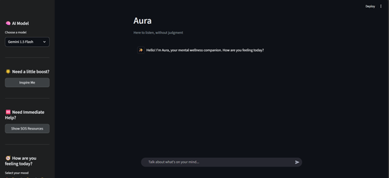
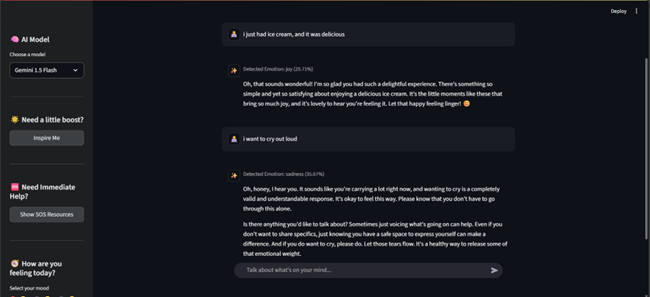
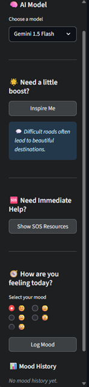
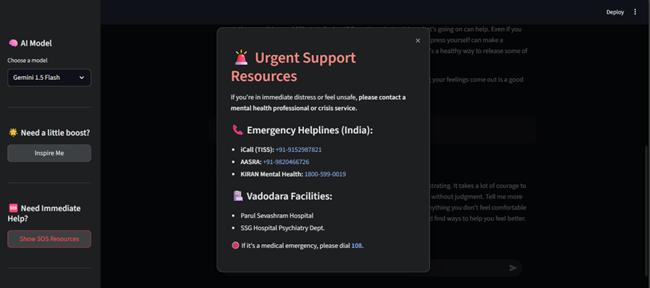

# 🌟 Aura: Your Mental Wellness Companion

**Aura** is an AI-powered mental health chatbot built using Streamlit and Google Gemini models. Designed with empathy and emotional intelligence, Aura engages users in supportive conversations, detects emotional tone, and offers motivational quotes, SOS resources, and mental health tracking tools — all with a focus on user privacy and well-being.



---

## 🚀 Project Overview

Mental health is a growing concern, especially in high-stress, tech-driven environments. Aura addresses this challenge with a virtual companion that listens without judgment, understands emotional cues, and provides timely support — from motivational nudges to emergency resources.

This chatbot leverages Gemini AI models, emotion detection, and natural language processing (NLP) to make mental wellness more accessible and personalized.

---

## 🎯 Features

- **🔁 Model Selector (Gemini 1.5 Flash, Pro, Gemma 3)**  
  Easily switch between AI models in the sidebar for performance, speed, or cost optimization.

- **🧠 Emotion Detection**  
  Real-time analysis of user messages to infer emotional states (e.g., sad, angry, anxious).

- **💬 Chat with Aura**  
  Conversational UI with memory to simulate an empathetic friend and guide.

- **📈 Mood Tracker**  
  Daily emoji-based mood logging with a historical view in the sidebar.

- **🌟 Motivational Quotes**  
  Random inspiration at the click of a button to uplift your spirit.

- **🆘 SOS Modal**  
  Triggered when distress keywords are detected (e.g., "I want to die", "hopeless"), the chatbot immediately displays emergency helplines and mental health resources.

---

## 📸 UI Preview

> Chat Interface | Sidebar Features | SOS Modal  
> :-------------:|:----------------:|:----------:  
>  |  | 

---

## 🧰 Tech Stack

| Tool / Library         | Purpose                              |
|------------------------|--------------------------------------|
| **Streamlit**          | Frontend and UI rendering            |
| **Google Gemini API**  | Conversational AI responses          |
| **Python**             | Core backend logic                   |
| **Custom CSS**         | Styling and UI customization         |
| **Pandas**             | Mood tracking data handling          |
| **HTML + JS**          | Modal popup and interactivity        |
| **Git & GitHub**       | Version control and collaboration    |

---

## 🏗️ Project Structure

```
📁 MENTAL-HEALTH-CHATBOT/
│
├── 📁 __pycache__/      # Python's cached files (auto-generated)
├── 📁 assets/           # Folder for static assets like images or logos
├── 📄 .env               # Stores secret keys, like your GEMINI_API_KEY
├── 📄 .gitignore         # Tells Git which files to ignore (like .env and __pycache__)
├── 🐍 app.py             # The main Streamlit application file that runs the chatbot
├── 🐍 backup.py          # (Likely for backing up data or code)
├── 🐍 chatbot.py         # Contains the emotion detection logic
├── 🐍 gemini_bot.py      # Handles the API calls to the Google Gemini models
├── 🐍 mood_tracker.py    # Logic for logging and retrieving user mood history
├── 🐍 motivational_quotes.py # Provides random motivational quotes
├── 📄 README.md           # The project documentation for GitHub
├── 📄 requirements.txt    # Lists all the Python libraries needed for the project
├── 🐍 sos.py             # Manages the SOS trigger and the pop-up modal
├── 📄 style.css          # (Likely an older CSS file, as styles are now in app.py)
├── 🐍 test_api.py        # A script for testing API connections
└── 🐍 utils.py           # (Likely for utility or helper functions)
```

---

## 💡 Getting Started

### 1. Clone the Repo

```bash
git clone https://github.com/your-username/aura-chatbot.git
cd aura-chatbot
```

### 2. Set Up Environment

```bash
pip install -r requirements.txt
```

### 3. Add Your API Key

Create a `.env` file and add:

```env
GOOGLE_API_KEY=your_google_gemini_api_key
```

### 4. Run the App

```bash
streamlit run app.py
```

---

## 🧠 Future Enhancements

- Voice-based chat integration
- Journaling feature
- Localized language support (Gujarati, Hindi, etc.)
- Integration with wearable data (sleep/mood correlation)
- Secure backend for mood history

